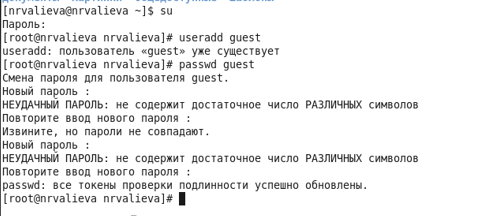
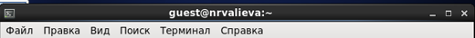
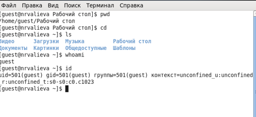
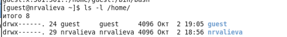
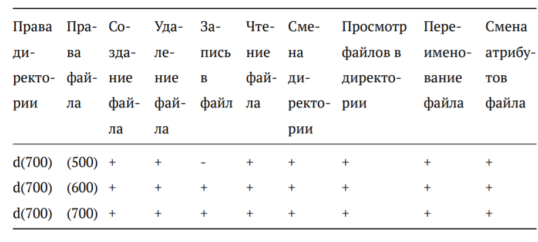
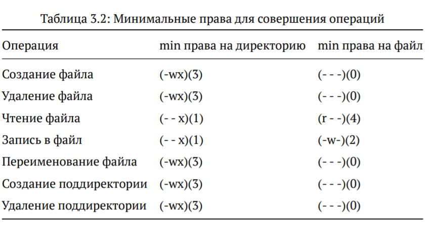

---
## Front matter
lang: ru-RU
title: Лабораторная работа №2
author: |
	Валиева Найля Разимовна - студентка группы НКНбд-01-18
date: 02.10.2021

## Formatting
toc: false
slide_level: 2
theme: metropolis
header-includes: 
 - \metroset{progressbar=frametitle,sectionpage=progressbar,numbering=fraction}
 - '\makeatletter'
 - '\beamer@ignorenonframefalse'
 - '\makeatother'
aspectratio: 43
section-titles: true
---

# Установка и конфигурация операционной системы на виртуальную машину"

## Прагматика выполнения

- Атрибуты являются важным компонентом файловой системы, поскольку позволяют проверять права доступа для пользователей.

## Цель выполнения лабораторной работы

- Получение практических навыков работы в консоли с атрибутами файлов, закрепление теоретических основ дискреционного разграничения доступа в современных системах с открытым кодом на базе ОС Linux.

## Задачи выолнения работы

- Создать учетную запись пользователя guest.
- Войти в терминал, используя созданную учетную запись, и выполнить ряд команд.
- Заполнить таблицу "Установленные права и разрешенные действия"
- Заполнить таблицу "Минимальные права для совершения операций"

## Результаты выполнения лабораторной работы

- В установленной при выполнении предыдущей лабораторной работы операционной системе была создана учётная запись пользователя guest и был произведен вход в нее (рис -@fig:001, рис -@fig:002)

{ #fig:001 width=70% }

##

{ #fig:002 width=70% }

##

- Вход в терминал, используя созданную учетную запись, и выполнение ряда команд. Ниже приведены примеры команд, которые были использованы в ходе лабораторной работы (рис -@fig:003, рис -@fig:004)

{ #fig:003 width=70% }

##

{ #fig:004 width=70% }

##

- Была заполнена таблица "Установленные права и разрешенные действия" (рис -@fig:005)

{ #fig:005 width=70% }

##

- Была заполнена таблица "Минимальные права для совершения операций" (рис -@fig:006)

{ #fig:006 width=70% }

##

Таким образом, я получила практические навыки работы в консоли с атрибутами файлов, закрепила теоретические основы дискреционного разграничения доступа в современных системах с открытым кодом на базе ОС Linux.