---
# Front matter
lang: ru-RU
title: "Лабораторная работа №4"
subtitle: "Дискреционное разграничение прав в Linux. Два пользователя"
author: "Валиева Найля Разимовна"

# Formatting
toc-title: "Содержание"
toc: true # Table of contents
toc_depth: 2
lof: true # List of figures
lot: true # List of tables
fontsize: 12pt
linestretch: 1.5
papersize: a4paper
documentclass: scrreprt
polyglossia-lang: russian
polyglossia-otherlangs: english
mainfont: PT Serif
romanfont: PT Serif
sansfont: PT Sans
monofont: PT Mono
mainfontoptions: Ligatures=TeX
romanfontoptions: Ligatures=TeX
sansfontoptions: Ligatures=TeX,Scale=MatchLowercase
monofontoptions: Scale=MatchLowercase
indent: true
pdf-engine: lualatex
header-includes:
  - \linepenalty=10 # the penalty added to the badness of each line within a paragraph (no associated penalty node) Increasing the value makes tex try to have fewer lines in the paragraph.
  - \interlinepenalty=0 # value of the penalty (node) added after each line of a paragraph.
  - \hyphenpenalty=50 # the penalty for line breaking at an automatically inserted hyphen
  - \exhyphenpenalty=50 # the penalty for line breaking at an explicit hyphen
  - \binoppenalty=700 # the penalty for breaking a line at a binary operator
  - \relpenalty=500 # the penalty for breaking a line at a relation
  - \clubpenalty=150 # extra penalty for breaking after first line of a paragraph
  - \widowpenalty=150 # extra penalty for breaking before last line of a paragraph
  - \displaywidowpenalty=50 # extra penalty for breaking before last line before a display math
  - \brokenpenalty=100 # extra penalty for page breaking after a hyphenated line
  - \predisplaypenalty=10000 # penalty for breaking before a display
  - \postdisplaypenalty=0 # penalty for breaking after a display
  - \floatingpenalty = 20000 # penalty for splitting an insertion (can only be split footnote in standard LaTeX)
  - \raggedbottom # or \flushbottom
  - \usepackage{float} # keep figures where there are in the text
  - \floatplacement{figure}{H} # keep figures where there are in the text
---

# Цель работы

Получение практических навыков работы в консоли с расширенными атрибутами файлов [1]

# Задание

1. Создать от имени пользователя файл с расширенным атрибутом \texttt{a} и выполнить ряд операций.
2. Снять расширенный атрибут \texttt{a} с файла и выполнить ряд команд
3. Заменить расширенный атрибут \texttt{a} на расширенный атрибут \texttt{i} и повторить операции.
4. Заполнить таблицу, поясняющую какие операции возможны при различных установленных атрибутах.

# Выполнение лабораторной работы

1.  От имени пользователя \texttt{guest} определила расширенные атрибуты файла texttt{/home/guest/dir1/file} (рис - @fig:001).

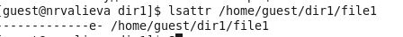{ #fig:001 width=70% }

Установила командой \texttt{chmod 600 file} на файл \texttt{file} права, разрешающие чтение и запись для владельца файла (рис -@fig:002).

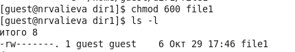{ #fig:002 width=70% }

Попробовала установить на файл \texttt{/home/guest/dir1/file} расширенный атрибут \texttt{a} от имени пользователя \texttt{guest} с помощью команды \texttt{chattr +a /home/guest/dir1/file} (рис -@fig:003).

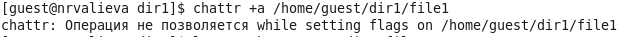{ #fig:003 width=70% }

Получила отказ от выполнения операции.  

Зашла в отдельную консоль с правами администратора. Установила расширенный атрибут \texttt{a} на файл \texttt{/home/guest/dir1/file} от имени суперпользователя с помощью команды \texttt{chattr +a /home/guest/dir1/file}. (рис -@fig:004)

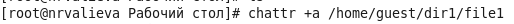{ #fig:004 width=70% }

От имени пользователя \texttt{guest} проверила правильность установления атрибута с помощью команды \texttt{lsattr /home/guest/dir1/file} (рис. -@fig:005)

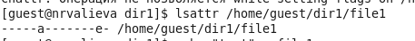{ #fig:005 width=70% }

Выполнила дозапись в файл \texttt{file} слова "test" командой \texttt{echo > "test" /home/guest/dir1/file}. Дозапись удалась. После этого выполнила чтение файла \texttt{file} командой \texttt{cat /home/guest/dir1/file}. Прочтение файла возможно (рис -@fig:006).

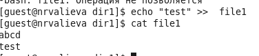{ #fig:006 width=70% }

Попробовала перезаписать имеющуюся в файле информацию командой \texttt{echo "abcd" > /home/guest/dir1/file}. Перезаписывание информации не удалось. (рис. -@fig:007)

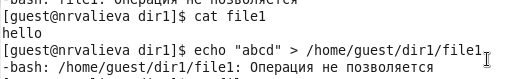{ #fig:007 width=70% }

Попробовала переименовать файл с помощью команды \texttt{mv /home/guest/dir1/file my\_file}. Переименование файла не удалось. (рис. -@fig:008)

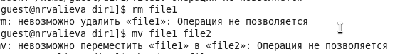{ #fig:008 width=70% }

Попробовала с помощью команды \texttt{chmod 000 file} установить на файл \texttt{file} права, запрещающие чтение и запись для владельца файла. Установка прав не удалась. (рис -@fig:009)

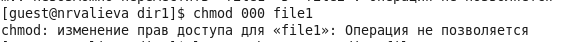{ #fig:009 width=70% }

2. Сняла расширенный атрибут \texttt{a} с файла \texttt{/home/guest/dir1/file} от имени суперпользователя командой \texttt{chattr -a /home/guest/dir1/file} (рис -@fig:010)

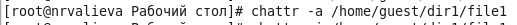{ #fig:010 width=70% }

Повторила операции, которые ранее не удавалось выполнить (рис -@fig:011, рис -@fig:012, рис -@fig:013, рис -@fig:014).

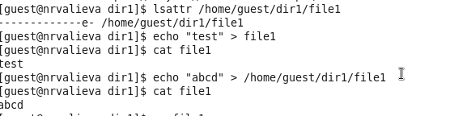{ #fig:011 width=70% }

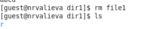{ #fig:012 width=70% }

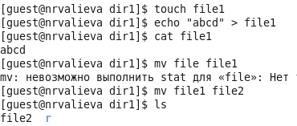{ #fig:013 width=70% }

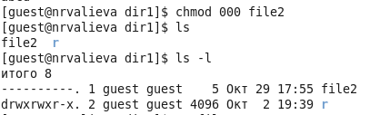{ #fig:014 width=70% }

Все вышеприведенные на скриншотах операции удалось выполнить.

3. Повторила действия по шагам, заменив атрибут \texttt{a} на атрибут \texttt{i}
(рис -@fig:015, рис -@fig:016, рис -@fig:017, рис -@fig:018, рис -@fig:019, рис -@fig:020).

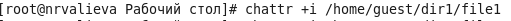{ #fig:015 width=70% }

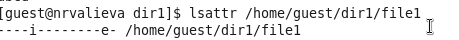{ #fig:016 width=70% }

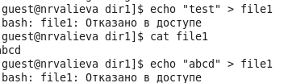{ #fig:017 width=70% }

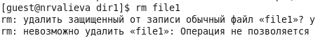{ #fig:018 width=70% }

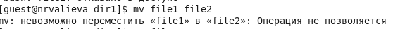{ #fig:019 width=70% }

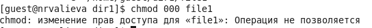{ #fig:020 width=70% }

4. Заполнила таблицу "Результат проведения операция с расширенными атрибутами" (таб. 3.1)

|Операции            |Без расширенных атрибутов|С расширенным атрибутом а|С расширенным атрибутом i|
|--------------------|-------------------------|-------------------------|-------------------------|
|Дозапись в файл     |+                        |+                        |-                        |
|Чтение файла        |+                        |+                        |+                        |
|Удаление файла      |+                        |-                        |-                        |
|Переименование файла|+                        |-                        |-                        |
|Установка прав      |+                        |-                        |-                        |

: Результат проведения операция с расширенными атрибутами

# Выводы

Таким образом я получила практические навыки работы в консоли с расширенными атрибутами файлов.

# Список литературы

1. Кулябов Д. С., Королькова А. В., Геворкян М. Н. Информационная безопасность компьютерных сетей. Лабораторная работа № 4. Дискреционное разграничение прав в Linux. Расширенные атрибуты
