---
# Front matter
lang: ru-RU
title: "Лабораторная работа №5"
subtitle: "Дискреционное разграничение прав в Linux. Дискреционное разграничение прав в Linux. Исследование влияния дополнительных атрибутов"
author: "Валиева Найля Разимовна"

# Formatting
toc-title: "Содержание"
toc: true # Table of contents
toc_depth: 2
lof: true # List of figures
lot: true # List of tables
fontsize: 12pt
linestretch: 1.5
papersize: a4paper
documentclass: scrreprt
polyglossia-lang: russian
polyglossia-otherlangs: english
mainfont: PT Serif
romanfont: PT Serif
sansfont: PT Sans
monofont: PT Mono
mainfontoptions: Ligatures=TeX
romanfontoptions: Ligatures=TeX
sansfontoptions: Ligatures=TeX,Scale=MatchLowercase
monofontoptions: Scale=MatchLowercase
indent: true
pdf-engine: lualatex
header-includes:
  - \linepenalty=10 # the penalty added to the badness of each line within a paragraph (no associated penalty node) Increasing the value makes tex try to have fewer lines in the paragraph.
  - \interlinepenalty=0 # value of the penalty (node) added after each line of a paragraph.
  - \hyphenpenalty=50 # the penalty for line breaking at an automatically inserted hyphen
  - \exhyphenpenalty=50 # the penalty for line breaking at an explicit hyphen
  - \binoppenalty=700 # the penalty for breaking a line at a binary operator
  - \relpenalty=500 # the penalty for breaking a line at a relation
  - \clubpenalty=150 # extra penalty for breaking after first line of a paragraph
  - \widowpenalty=150 # extra penalty for breaking before last line of a paragraph
  - \displaywidowpenalty=50 # extra penalty for breaking before last line before a display math
  - \brokenpenalty=100 # extra penalty for page breaking after a hyphenated line
  - \predisplaypenalty=10000 # penalty for breaking before a display
  - \postdisplaypenalty=0 # penalty for breaking after a display
  - \floatingpenalty = 20000 # penalty for splitting an insertion (can only be split footnote in standard LaTeX)
  - \raggedbottom # or \flushbottom
  - \usepackage{float} # keep figures where there are in the text
  - \floatplacement{figure}{H} # keep figures where there are in the text
---

# Цель работы

Изучение механизмов изменения идентификаторов, применения SetUID- и Sticky-битов. Получение практических навыков работы в консоли с дополнительными атрибутами. Рассмотрение работы механизма смены идентификатора процессов пользователей, а также влияние бита Sticky на запись и удаление файлов. [1]

# Задание

1. Подготовить лабораторный стенд
2. Рассмотреть компиляцию программ
3. Создать программы
4. Исследовать Sticky-бит

# Выполнение лабораторной работы

1. Предварительно установила компилятор gcc с помощью команды \texttt{yum install gcc} (рис - @fig:001).

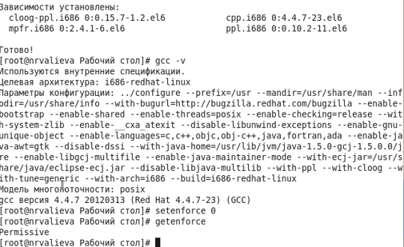{ #fig:001 width=70% }

Отключила систему защиты SELinux с помощью команды \texttt{setenforce 0}. После этого команда \texttt{getenforce} вывела \texttt{Permissive} (рис -@fig:002).

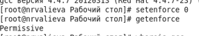{ #fig:002 width=70% }

2. Изучила компиляцию программ. Компилятор языка С называется gcc. Компилятор языка С++ называется g++ и запускается с параметрами почти так же, как gcc. Проверила это с поомщью команд \texttt{whereis gcc} и \texttt{whereis g++} (рис -@fig:003).

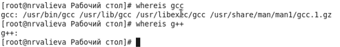{ #fig:003 width=70% }

3. Вошла в в систему от имени пользователя \texttt{guest} и создала программу \texttt{simpleid.c} (рис -@fig:004 и рис -@fig:005).

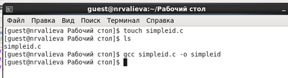{ #fig:004 width=70% }

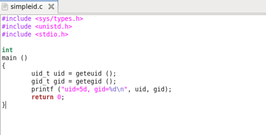{ #fig:005 width=70% }

Скомпилировала программу и убедилась, что файл программы создан с помощью команды \texttt{gcc simpleid.c -o simpleid} (рис -@fig:006)

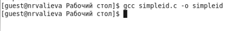{ #fig:006 width=70% }

Выполнила программу \texttt{simpleid} (рис -@fig:007)

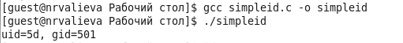{ #fig:007 width=70% }

Выполнила системную программу \texttt{id} (рис -@fig:008)

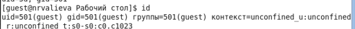{ #fig:008 width=70% }

Вывод обоих команд совпадает.  

Усложнила программу, добавив вывод действительных идентификаторов (рис -@fig:009)

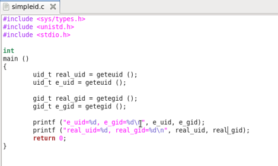{ #fig:009 width=70% }

Получившуюся программу назвала \texttt{simpleid2.c} (рис -@fig:010)

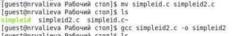{ #fig:010 width=70% }

Скомпилировала и запустила \texttt{simpleid2.c} (рис -@fig:011)

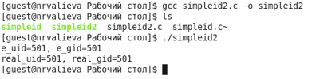{ #fig:011 width=70% }

От имени суперпользователя выполнила следующие команды (рис -@fig:012)

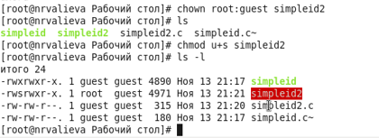{ #fig:012 width=70% }

Использовала \texttt{su} для временного повышения своих прав (рис -@fig:013)

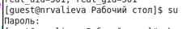{ #fig:013 width=70% }

Команда \texttt{su} используется для получения прав суперпользователя.  

Выполнила проверку правильности установки новых атрибутов и смены владельца файла \texttt{simpleid2} (рис -@fig:014)

{ #fig:014 width=70% }

Запустила \texttt{simpleid2} и \texttt{id} (рис -@fig:015)

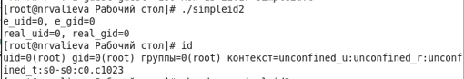{ #fig:015 width=70% }

Проделала то же самое относительно SetGID-бита (рис -@fig:016)

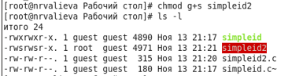{ #fig:016 width=70% }

Создала программу \texttt{readfile.c} (рис -@fig:017 и рис -@fig:018)

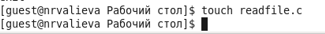{ #fig:017 width=70% }

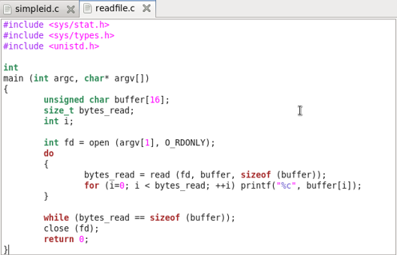{ #fig:018 width=70% }

Откомпилировала созданную программу (рис -@fig:019)

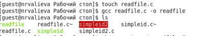{ #fig:019 width=70% }

Сменила владельца у файла \texttt{readfile.c} и изменила права так, чтобы только суперпользователь мог прочитать его, а \texttt{guest} не мог (рис -@fig:020)

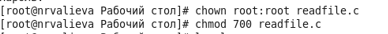{ #fig:020 width=70% }

Проверила, что пользователь \texttt{guest} не может прочитать файл \texttt{readfile.c} (рис -@fig:021)

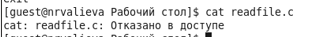{ #fig:021 width=70% }

Сменила у программы \texttt{readfile} владельца и установила SetUID-бит (рис -@fig:022)

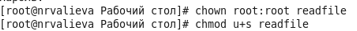{ #fig:022 width=70% }

Проверила, может ли программа \texttt{readfile} прочитать файл \texttt{readfile.c}. Да, может. (рис -@fig:023 и рис -@fig:024)

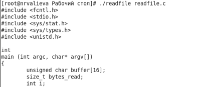{ #fig:023 width=70% }

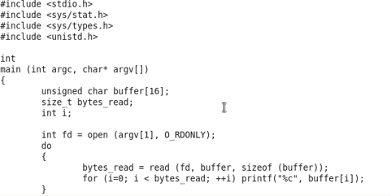{ #fig:024 width=70% }

Проверила, может ли программа \texttt{readfile} прочитать файл \texttt{/etc/shadow}. Да, может. (рис -@fig:025)

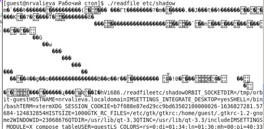{ #fig:025 width=70% }

4. Исследовала Sticky-бит  
Выяснила, что атрибут Sticky установлен на директорию \texttt{/tmp}, для чего выполнила команду \texttt{ls -l / | grep tmp} (рис -@fig:026)

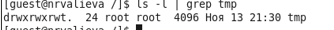{ #fig:026 width=70% }

От имени пользователя \texttt{guest} создала файл \texttt{file01.txt} в директории \texttt{/tmp} со словом \texttt{test} (рис -@fig:027):

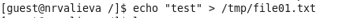{ #fig:027 width=70% }

Просмотрела атрибуты у только что созданного файла и разрешила чтение и запись для категории пользователей "все остальные" (рис -@fig:028):

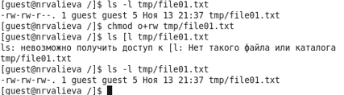{ #fig:028 width=70% }

От имени пользователя \texttt{guest2} (не являющегося владельцем) прочитала файл \texttt{/tmp/file01.txt} (рис -@fig:029):

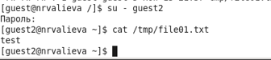{ #fig:029 width=70% }

От имени пользователя \texttt{guest2} дозаписала в файл \texttt{/tmp/file01.txt} слово \texttt{test2} (рис -@fig:030):

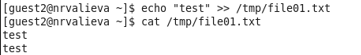{ #fig:030 width=70% }

Проверила содержимое файла (рис -@fig:031):

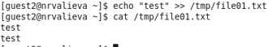{ #fig:031 width=70% }

От имени пользователя \texttt{guest2} записала в файл \texttt{/tmp/file01.txt} слово \texttt{test3}, стерев при этом всю имеющуюся в файле информацию (рис -@fig:032):

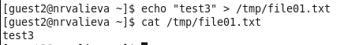{ #fig:032 width=70% }

Проверила содержимое файла (рис -@fig:033):

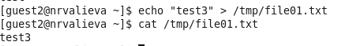{ #fig:033 width=70% }

От имени пользователя \texttt{guest2} попробовала удалить файл \texttt{/tmp/file01.txt} (рис -@fig:034):

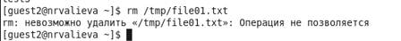{ #fig:034 width=70% }

Мне не удалось удалить файл.  

Повысила свои права до суперпользователя и выполнила после этого команду, снимающую атрибут \texttt{t} (Sticky-бит) с директории \texttt{/tmp}(рис -@fig:035):

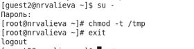{ #fig:035 width=70% }

Покинула режим суперпользователя командой \texttt{exit} (рис -@fig:036):

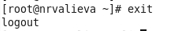{ #fig:036 width=70% }

От имени пользователя \texttt{guest2} проверила, что атрибута \texttt{t} у директории \texttt{/tmp} нет (рис -@fig:037):

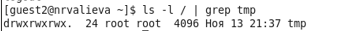{ #fig:037 width=70% }

Повторила предыдущие шаги (рис -@fig:038):

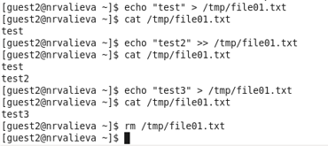{ #fig:038 width=70% }

Как видно из рисунка, удалось выполнить все команды, которые были рассмотрены выше, включая удаление.  

Повысила свои права до суперпользователя и вернула атрибут \texttt{t} на директорию \texttt{/tmp} (рис -@fig:039):

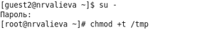{ #fig:039 width=70% }

# Выводы

Изучила механизмы изменения идентификаторов, применения SetUID- и Sticky-битов. Получила практические навыки работы в консоли с дополнительными атрибутами. Рассмотрела работу механизма смены идентификатора процессов пользователей, а также влияние бита Sticky на запись и удаление файлов.

# Список литературы

1. Кулябов Д. С., Королькова А. В., Геворкян М. Н. Информационная безопасность компьютерных сетей. Лабораторная работа № 5. Дискреционное разграничение прав в Linux. Исследование влияния дополнительных атрибутов
